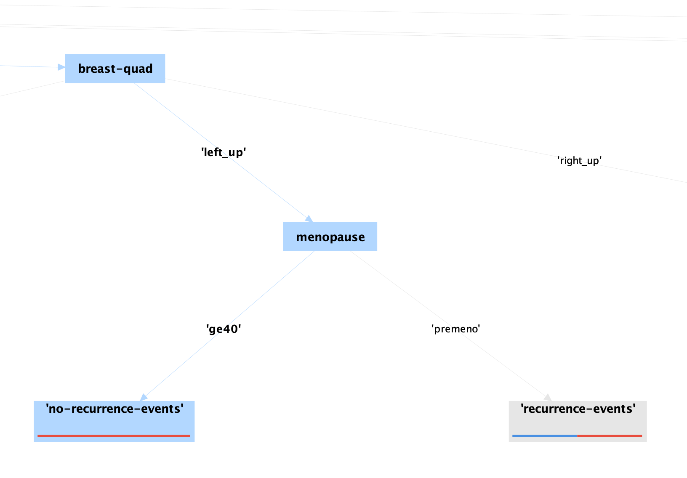

# Homework 2 - Enrico Castelli s280124

## Data Mining with RapidMiner

### 1.

#### (a)

The most discriminative parameter, which is the root of the decision tree, is `node-caps`, meaning that if the cancer has infiltrated the lymph nodes (`node-caps`=`yes`) there is an higher probability that it will present itself again in the future.  

| node-caps       | yes     | no     |   ? |
| :------------- | :----------: | -----------: | --: |
|  probability of recurrence | 22.97%   | 55.36%   | 37.5% |

#### (b)

The height of the generated Decision Tree is 7, counting the root of the tree.  

An example of a pure partition would be the following:

Where the decisions to reach it are:  
node-caps[no] -> irradiat[no] -> tumor-size[35-39] -> breast-quad[left_up] -> menopause[ge40] -> no-recurrence-events

### 2.

| minimal gain | maximal depth | screenshot |
| :----------- | :------------ | :--------- |
| any number from 0 to 1 | 1 |  |
| 0.01 | 2 |  |
| 0.06 | 3 |  |
| 0.07 | 3 |  |
| 0.06 | 6 |  |

From the table above, it emerges that the maximum value of the minimal gain that still yields a Decision Tree with nodes other than the root node is 0.06.  

The maximal depth increases the number of decisions the Decision Tree can show. When it is 1, it is obvious that no node other than the root node can be shown. For higher values, it shows increasingly complex decision ramifications. When it is 2, only the first set of leaves is visible, hence the most discriminative parameter becomes apparent. For a value of 3, we can see how `deg-malig` and `irradiat` influence the decision; for example, a degree of 2 indicates a lower probability of reoccurring tumor instead of a degree of 3. When the maximal depth is 6, we can see more details in the ramification of the degree of 3.

### 3.

| minimal gain | maximal depth | screenshot |
| :----------- | :------------ | :--------- |
| any number from 0 to 1 | 1 |  |
| 0.01 | 2 |  |
| 0.01 | 10 |  |
| 0.06 | 10 |  |
| 0.06 | 3 |  |
| 0.07 | 3 |  |
| 0.06 | 6 |  |
| from 0.01 to 0.05 | 3 |  |

From the table above, we can see that with a maximal depth of 1 the tree does not predict any `recurrence` events, so the accuracy is simply the number of `no-recurrence` events divided by the total events multiplied by 100.  
The minimal gain has no impact on the results in the range [0.01, 0.05]. It has a negative impact in the range [0.06, 1].  
The maximal depth yields the best results when set with a value of 3. Any value below or above lowers the percentage of correct predictions of the model.