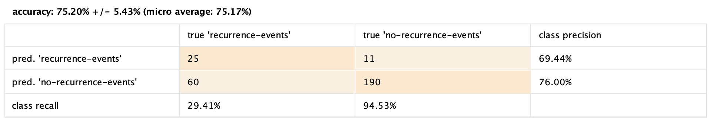

# Homework 2 - Enrico Castelli s280124

## Data Mining with RapidMiner

### 1.

#### (a)

The most discriminative parameter, which is the root of the decision tree, is `node-caps`, meaning that if the cancer has infiltrated the lymph nodes (`node-caps`=`yes`) there is an higher probability that it will present itself again in the future.  

| node-caps       | yes     | no     |   ? |
| :------------- | :----------: | -----------: | --: |
|  probability of recurrence |  55.36%  | 22.97%   | 37.5% |

#### (b)

The height of the generated Decision Tree is 7, counting the root of the tree.  

An example of a pure partition would be the following:

Where the decisions to reach it are:  
node-caps[no] -> irradiat[no] -> tumor-size[35-39] -> breast-quad[left_up] -> menopause[ge40] -> no-recurrence-events

### 2.

| minimal gain | maximal depth | screenshot |
| :----------- | :------------ | :--------- |
| any number from 0 to 1 | 1 |  |
| 0.01 | 2 |  |
| 0.06 | 3 |  |
| 0.07 | 3 |  |
| 0.06 | 6 |  |

From the table above, it emerges that the maximum value of the minimal gain that still yields a Decision Tree with nodes other than the root node is 0.06.  

The maximal depth increases the number of decisions the Decision Tree can show. When it is 1, it is obvious that no node other than the root node can be shown. For higher values, it shows increasingly complex decision ramifications. When it is 2, only the first set of leaves is visible, hence the most discriminative parameter becomes apparent. For a value of 3, we can see how `deg-malig` and `irradiat` influence the decision; for example, a degree of 2 indicates a lower probability of reoccurring tumor instead of a degree of 3. When the maximal depth is 6, we can see more details in the ramification of the degree of 3.

### 3.

| minimal gain | maximal depth | screenshot |
| :----------- | :------------ | :--------- |
| any number from 0 to 1 | 1 |  |
| 0.01 | 2 |  |
| 0.01 | 10 |  |
| 0.06 | 10 |  |
| 0.06 | 3 |  |
| 0.07 | 3 |  |
| 0.06 | 6 |  |
| from 0.01 to 0.05 | 3 |  |

From the table above, we can see that with a maximal depth of 1 the tree does not predict any `recurrence` events, so the accuracy is simply the number of `no-recurrence` events divided by the total events multiplied by 100.  
The minimal gain has no impact on the results in the range [0.01, 0.05]. It has a negative impact in the range [0.06, 1].  
The maximal depth yields the best results when set with a value of 3. Any value below or above lowers the percentage of correct predictions of the model.

### 4.

| k | screenshot |
| :-- | :------- |
| 1 |  |
| 2 |  |
| 3 |  |
| 4 |  |
| 5 |  |
| 6 |  |
| 7 |  |
| 8 |  |
| 9 |  |
| 10 |  |

We can see from the table above that the K-Nearest Neighbor classifier with 10-fold cross-validation yields a correct prediction in at least 70% of the cases for a minimum value of 3. It performs best with a k value of 9, after that the performance starts dropping.  
Note: the even values of k have been included for completeness, but it is known that K-NN is facilitated in taking a decision when the number of neighbors considered k is odd.

Using the Naïve Bayes classifier with 10-fold cross-validation:

Considering only the accuracy of the K-NN classifier for odd values of k, its average performance is:  
$acc_{avg,k} = \frac{\sum\nolimits_{k \in 1, 3, 5, 7, 9} acc_k}{5} = \frac{66.44 + 70.26 + 73.77 + 74.84 + 75.20}{5} = \frac{360.47}{5} = 72.09$ %.  

The accuracy of the Naïve Bayes classifier is 72.45%, hence it performs better, in average and with the constraints considered above.

### 5.

#### (a)

Seeing the correlation matrix above, we cannot state that the Naïve Bayes independence assumption holds true for the features of the Breast dataset. Even if most of them have a very low correlation or anti-correlation, meaning correlation values near zero, not one of the features is completely independent of all of the others.  
This makes sense, since the characteristics of an entry in this dataset only refer to a specific tumor of a specific person.

#### (b)

The pair of most correlated attributes is `inv-nodes`-`irradiat` (0.399).  
The pair of most anti-correlated attributes is `inv-nodes`-`node-caps` (-0.465).