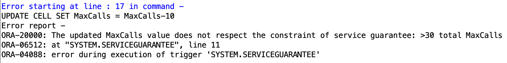

# Homework 3 - Enrico Castelli s280124

## Triggers

### 1) Switching on/off the phone

```sql
CREATE OR REPLACE TRIGGER UpdateTelephone
AFTER INSERT ON STATE_CHANGE
FOR EACH ROW
WHEN (NEW.ChangeType = 'O' OR NEW.ChangeType = 'F')
DECLARE
    PhoneCellId NUMBER(38,0);
BEGIN
    -- save CellId where the phone belongs
    SELECT CellId INTO PhoneCellId
    FROM CELL
    WHERE x0<=:NEW.x AND :NEW.x<x1 AND y0<=:NEW.y AND :NEW.y<y1;
    
    IF :NEW.ChangeType = 'O' THEN
        -- add phone to TELEPHONE table
        INSERT INTO TELEPHONE (PhoneNo, X, Y, PhoneState)
        VALUES (:NEW.PhoneNo, :NEW.x, :NEW.y, 'On');
        -- increase CurrentPhone# in corresponding cell
        UPDATE CELL 
        SET CurrentPhone# = CurrentPhone# + 1 
        WHERE CellId=PhoneCellId;
    ELSE
        -- remove phone from TELEPHONE table
        DELETE FROM TELEPHONE WHERE PhoneNo=:NEW.PhoneNo;
        -- decrease CurrentPhone# in corresponding cell
        UPDATE CELL 
        SET CurrentPhone# = CurrentPhone# - 1 
        WHERE CellId=PhoneCellId;
    END IF;
END;
/
```


After running `create_db_telefoni_en.sql` and the script that contains the triggers:

| Tables          |                                                              |
| --------------- | :----------------------------------------------------------- |
| `STATE_CHANGE`  |  |
| `EXCEPTION_LOG` |  |
| `CELL`          |  |
| `TELEPHONE`     |  |

After running

```sql
INSERT INTO STATE_CHANGE(ChangeId, TimeStamp, PhoneNo, x, y, ChangeType) values (1, sysdate, '333000010', 3, 3, 'O');
```

| Tables          |                                                              |
| --------------- | :----------------------------------------------------------- |
| `STATE_CHANGE`  |  |
| `EXCEPTION_LOG` |  |
| `CELL`          |  |
| `TELEPHONE`     |  |

After running

```sql
INSERT INTO STATE_CHANGE(ChangeId, TimeStamp, PhoneNo, x, y, ChangeType) values (2, sysdate, '333000009', 15, 15, 'O');
```

| Tables          |                                                              |
| --------------- | :----------------------------------------------------------- |
| `STATE_CHANGE`  |  |
| `EXCEPTION_LOG` |  |
| `CELL`          |  |
| `TELEPHONE`     |  |

After running

```sql
INSERT INTO STATE_CHANGE(ChangeId, TimeStamp, PhoneNo, x, y, ChangeType) values (3, sysdate, '333000009', 15, 15, 'F');
```

| Tables          |                                                              |
| --------------- | :----------------------------------------------------------- |
| `STATE_CHANGE`  |  |
| `EXCEPTION_LOG` |  |
| `CELL`          |  |
| `TELEPHONE`     |  |

We notice how the phone that was turned off has been removed from the `TELEPHONE` table.


### 2) Starting a phone call

```sql
CREATE OR REPLACE TRIGGER StartPhoneCall
AFTER INSERT ON STATE_CHANGE
FOR EACH ROW
WHEN (NEW.ChangeType = 'C')
DECLARE
    PhoneCellId NUMBER(38,0);
    CellMaxCalls NUMBER(38,0);
    CellX0 NUMBER(7,2); 
    CellY0 NUMBER(7,2); 
    CellX1 NUMBER(7,2); 
    CellY1 NUMBER(7,2); 
    CurrentCellCalls NUMBER(38,0);
    LastExId NUMBER(38,0);
BEGIN
    -- save cell info to variables
    SELECT CellId, MaxCalls, x0, y0, x1, y1 INTO PhoneCellId, CellMaxCalls, CellX0, CellY0, CellX1, CellY1
    FROM CELL
    WHERE x0<=:NEW.x AND :NEW.x<x1 AND y0<=:NEW.y AND :NEW.y<y1;
    
    -- save number of active phones in cell to variable
    SELECT COUNT(*) INTO CurrentCellCalls
    FROM TELEPHONE
    WHERE PhoneState='Active' AND CellX0<=x AND x<CellX1 AND CellY0<=y AND y<CellY1;
    
    IF CurrentCellCalls < CellMaxCalls THEN
        -- phone state becomes active
        UPDATE TELEPHONE
        SET PhoneState = 'Active'
        WHERE PhoneNo=:NEW.PhoneNo;
    ELSE
        -- save biggest ExId to variable (or use 1 if no ExIds in table)
        SELECT MAX(ExId) + 1 INTO LastExId 
        FROM EXCEPTION_LOG;
        IF LastExid IS NULL THEN
            LastExid := 1;
        END IF;    
        -- insert exception in EXCEPTION_LOG
        INSERT INTO EXCEPTION_LOG (ExId, CellId, ExceptionType)
        VALUES (LastExId, PhoneCellId, 'C');
    END IF;
END;
/
```

After running

```sql
INSERT INTO STATE_CHANGE(ChangeId, TimeStamp, PhoneNo, x, y, ChangeType) values (4, sysdate, '333000001', 3, 3, 'O');
```

| Tables          |                                                              |
| --------------- | :----------------------------------------------------------- |
| `STATE_CHANGE`  |  |
| `EXCEPTION_LOG` |  |
| `CELL`          |  |
| `TELEPHONE`     |  |

After running

```sql
INSERT INTO STATE_CHANGE(ChangeId, TimeStamp, PhoneNo, x, y, ChangeType) values (5, sysdate, '333000004', 5, 5, 'O');
```

| Tables          |                                                              |
| --------------- | :----------------------------------------------------------- |
| `STATE_CHANGE`  |  |
| `EXCEPTION_LOG` |  |
| `CELL`          |  |
| `TELEPHONE`     |  |

After running

```sql
INSERT INTO STATE_CHANGE(ChangeId, TimeStamp, PhoneNo, x, y, ChangeType) values (6, sysdate, '333000004', 5, 5, 'C');
```

| Tables          |                                                              |
| --------------- | :----------------------------------------------------------- |
| `STATE_CHANGE`  |  |
| `EXCEPTION_LOG` |  |
| `CELL`          |  |
| `TELEPHONE`     |  |

After running

```sql
INSERT INTO STATE_CHANGE(ChangeId, TimeStamp, PhoneNo, x, y, ChangeType) values (7, sysdate, '333000001', 3, 3, 'C');
```

| Tables          |                                                              |
| --------------- | :----------------------------------------------------------- |
| `STATE_CHANGE`  |  |
| `EXCEPTION_LOG` |  |
| `CELL`          |  |
| `TELEPHONE`     |  |

After running

```sql
INSERT INTO STATE_CHANGE(ChangeId, TimeStamp, PhoneNo, x, y, ChangeType) values (8, sysdate, '333000010', 3, 3, 'C');
```

| Tables          |                                                              |
| --------------- | :----------------------------------------------------------- |
| `STATE_CHANGE`  |  |
| `EXCEPTION_LOG` |  |
| `CELL`          |  |
| `TELEPHONE`     |  |

After running

```sql
INSERT INTO STATE_CHANGE(ChangeId, TimeStamp, PhoneNo, x, y, ChangeType) values (9, sysdate, '333000020', 4, 4, 'O');
```

| Tables          |                                                              |
| --------------- | :----------------------------------------------------------- |
| `STATE_CHANGE`  |  |
| `EXCEPTION_LOG` |  |
| `CELL`          |  |
| `TELEPHONE`     |  |

After running

```sql
INSERT INTO STATE_CHANGE(ChangeId, TimeStamp, PhoneNo, x, y, ChangeType) values (10, sysdate, '333000020', 4, 4, 'C');
```

| Tables          |                                                              |
| --------------- | :----------------------------------------------------------- |
| `STATE_CHANGE`  |  |
| `EXCEPTION_LOG` |  |
| `CELL`          |  |
| `TELEPHONE`     |  |


### 3) Changing the maximum number of active calls

```sql
CREATE OR REPLACE TRIGGER ChangeMaxCalls
BEFORE UPDATE OF MaxCalls ON CELL
FOR EACH ROW
WHEN (NEW.MaxCalls < OLD.MaxCalls)
DECLARE
    CurrentCellCalls NUMBER(38,0);
BEGIN
    -- save number of active phones in cell to variable
    SELECT COUNT(*) INTO CurrentCellCalls
    FROM TELEPHONE
    WHERE PhoneState='Active' AND :NEW.x0<=x AND x<:NEW.x1 AND :NEW.y0<=y AND y<:NEW.y1;
    
   IF CurrentCellCalls > :NEW.MaxCalls THEN
    :NEW.MaxCalls := CurrentCellCalls;
   END IF;
END;
/
```

After running

```sql
UPDATE CELL SET MaxCalls = MaxCalls-2;
```

| Tables          |                                                              |
| --------------- | :----------------------------------------------------------- |
| `STATE_CHANGE`  |  |
| `EXCEPTION_LOG` |  |
| `CELL`          |  |
| `TELEPHONE`     |  |

We notice how only the values of cells 2, 3 and 4 are updated.


### 4) Service guarantee

```sql
CREATE OR REPLACE TRIGGER ServiceGuarantee
AFTER UPDATE OF MaxCalls ON CELL
DECLARE
    TotalMaxCalls NUMBER(38,0);
BEGIN
    -- save the total number of MaxCalls for each cell to variable
    SELECT SUM(MaxCalls) INTO TotalMaxCalls
    FROM CELL;
    
    -- apply constraint
    IF TotalMaxCalls <= 30 THEN
        RAISE_APPLICATION_ERROR(-20000, 'The updated MaxCalls value does not respect the constraint of service guarantee: >30 total MaxCalls');
    END IF;
END;
/
```

After running

```sql
UPDATE CELL SET MaxCalls = MaxCalls-1;
```

| Tables          |                                                              |
| --------------- | :----------------------------------------------------------- |
| `STATE_CHANGE`  |  |
| `EXCEPTION_LOG` |  |
| `CELL`          |  |
| `TELEPHONE`     |  |

We notice how no error is raised because the constraint is respected.

After running

```sql
UPDATE CELL SET MaxCalls = MaxCalls-10;
```

| Tables          |                                                              |
| --------------- | :----------------------------------------------------------- |
| `STATE_CHANGE`  |  |
| `EXCEPTION_LOG` |  |
| `CELL`          |  |
| `TELEPHONE`     |  |



We notice how the `CELL` table does not change.