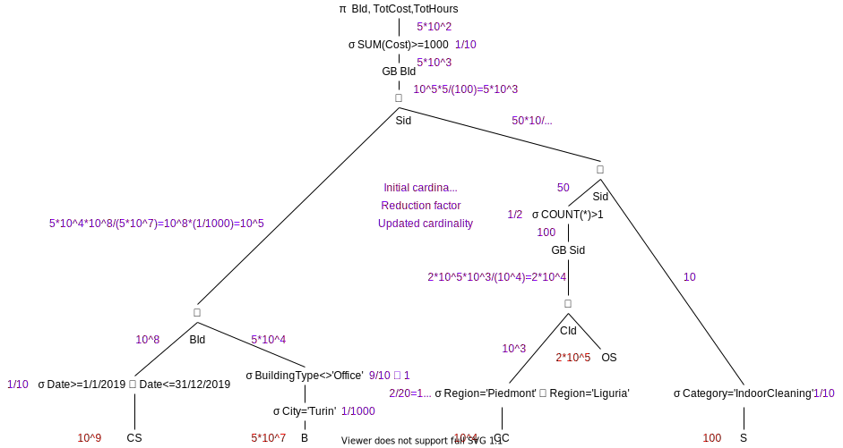

# Homework 4 - Enrico Castelli s280124

## Optimizer

### 1. Relational algebra

| Type of  | CS-B      | CC-OS     | [CC-OS]-S  | Antisemijoin                          | GB SId  | GB BId |
| -------- | --------- | --------- | ---------- | ------------------------------------- | ------- | ------ |
| JOIN     | hash join | hash join | merge join | nested loop, inner table on the right |         |        |
| GROUP BY |           |           |            |                                       | no sort | hash   |

The GROUP BY anticipation of GB BId is not possible, since the antisemijoin below it requires the SId attribute in the tuples of the joined tables.

The GROUP BY anticipation of GB SId, as seen in the figure below, aims to reduce the cardinality of the result set of the right branch as soon as possible (from 2*10^4 to 50).

After this GROUP BY anticipation, the JOIN and GROUP BY types change as following:

| Type of  | CS-B      | CC-OS     | [CC-OS]-S  | Antisemijoin                          | GB SId   | GB BId |
| -------- | --------- | --------- | ---------- | ------------------------------------- | -------- | ------ |
| JOIN     | hash join | hash join | merge join | nested loop, inner table on the right |          |        |
| GROUP BY |           |           |            |                                       | **sort** | hash   |

### 2. Physical structures

| Table | Index                               | Access Path                        | Access Path Without Index  |
| ----- | ----------------------------------- | ---------------------------------- | -------------------------- |
| CS    | primary B+tree on date              | index range scan                   | table access full + filter |
| B     | secondary hash on (BId, city)       | fast full index scan               | table access full + filter |
| CC    | secondary hash on region            | full index scan + access by row id | table access full + filter |
| OS    | no index because selectivity is low |                                    | table access full          |
| S     | no index because table is small     |                                    | table access full + filter |

