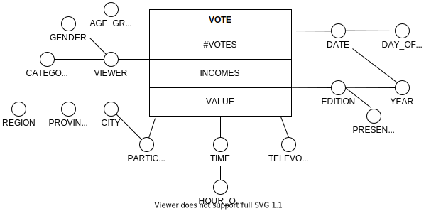

# Homework 1 - Enrico Castelli s280124

## Data Warehouse

#### Conceptual schema

#### Logical schema

VIEWER(_VID_, AGEGROUP, GENDER, CATEGORY, _LID_)  
LOCATION(_LID_, CITY, PROVINCE, REGION)  
PARTICIPANT(_PID_, PARTICIPANTNAME, _LID_)  
TIMETABLE(_TID_, TIME, HOUROFDAY)  
TELEVOTING(_TVID_, TELEVOTINGMODE)  
EDITIONTABLE(_EID_, PRESENTER, YEAR)  
DATETABLE(_DID_, DATE, DAYOFWEEK, _EID_)  

Facts table:  
VOTE(_VTID_, _VID_, _PID_, _TID_, _TVID_, _EID_, _DID_, #VOTES, INCOMES, VALUE)

## Queries

#### (a)

#### (b)